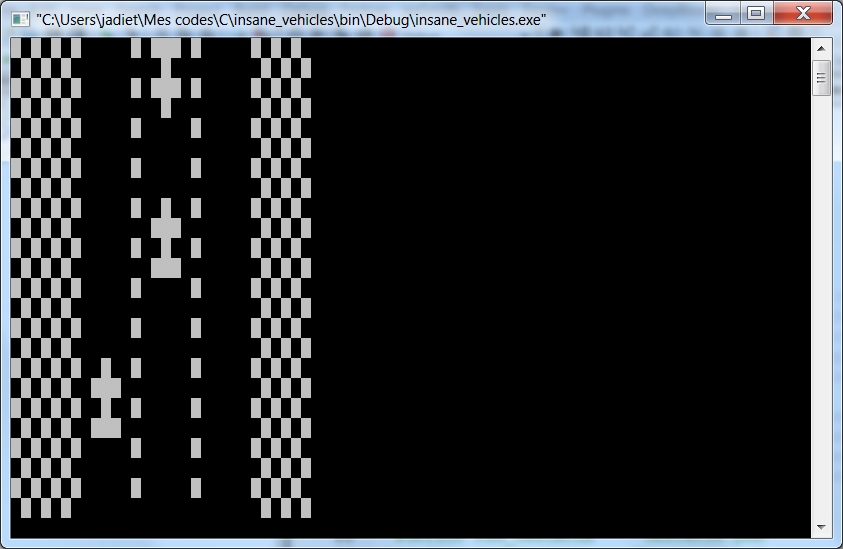

# Rattrapage de projet système et langage C
## CONTEXTE DU RATTRAPAGE
Il s’agit de faire un plus petit programme que celui demandé initialement. Etant donné que vous devez réaliser ce programme seul, il est normal qu’il soit moins complexe. Cependant, cette réalisation permettra d’évaluer les mêmes connaissances et compétences que le projet initial.

Vous devrez programmer un jeu de course vu de dessus. Dans ce jeu, une voiture se déplace en contresens sur une route à trois voies. Le véhicule peut changer de voie afin d’éviter les autres voitures (qui elles restent sur leur voie). Le jeu s’arrête dès la première collision.

## FONCTIONNALITES DEMANDEES
La voiture du joueur ne se déplace que latéralement. Elle ne peut ni avancer, ni reculer, ni accélérer, ni ralentir.

La route défile toujours à la même vitesse.

Les véhicules adverses sont positionnés aléatoirement sur le trajet. Ils avancent tous à la même vitesse. Ils sont tous identiques.

Le jeu s’arrête dès que la voiture du joueur entre en contact avec un autre véhicule.

Un soin particulier sera apporté à la modularisation et la factorisation de votre code.
* une bibliothèque .h/.c pour lire et afficher les PBM
* une bibliothèque .h/.c pour gérer la route
* une bibliothèque .h/.c pour gérer la voiture du joueur
* une bibliothèque .h/.c pour gérer le jeu
* *cette liste n'est pas exhaustive*

## CONTRAINTES
Tous les affichages doivent se faire en lisant les images PBM fournies :
* MyVehicle.pbm : représente la voiture du joueur
* Obstacle.pbm : représente les autres voitures
* Ditch.pbm : représente le bord de route
* Macadam.pbm : représente une voie de la route

Le jeu doit fonctionner sous linux.

## LIVRABLES ET DATE
Aucun document autre que le code source commenté et présent dans ce dépôt git n'est demandé.

Une présentation rapide du code ainsi qu'une démonstration du jeu sera faîtes à votre tuteur le **mercredi 1 février 2017**.

## EXEMPLE DE RESULTAT ATTENDU

